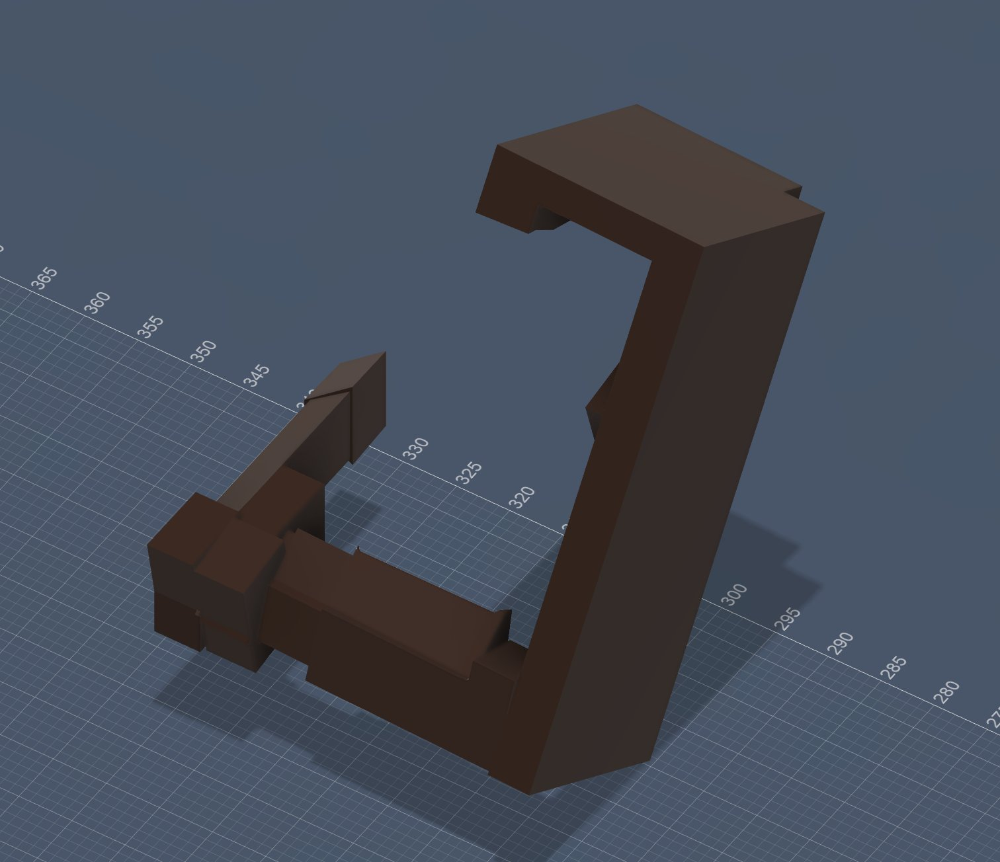
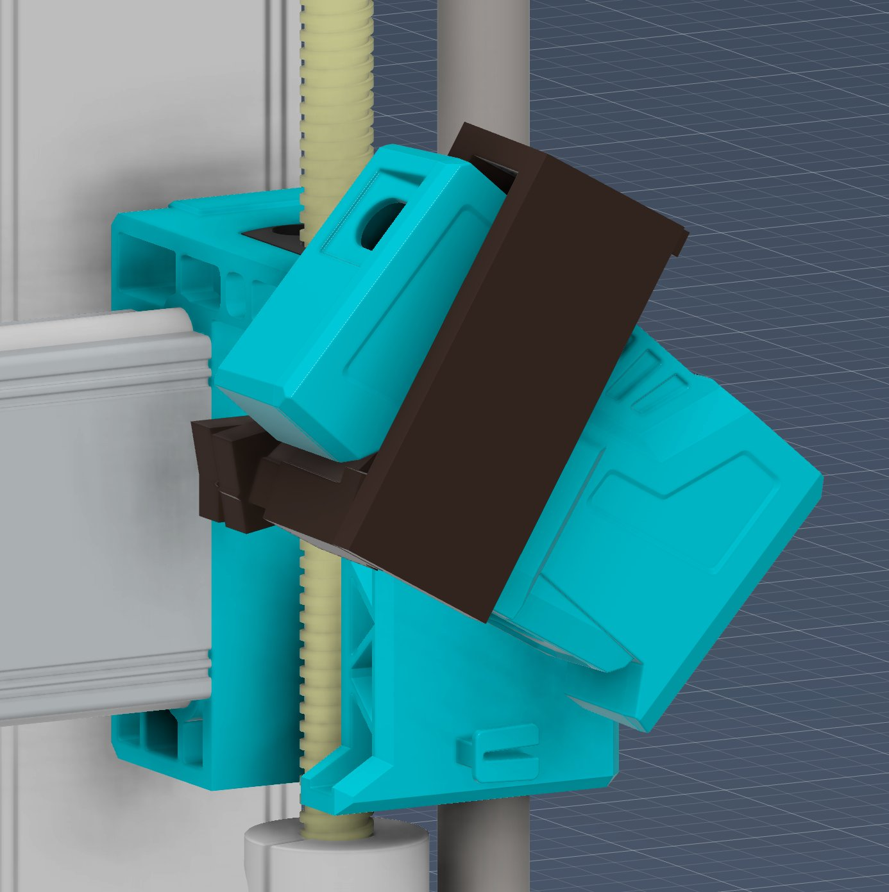
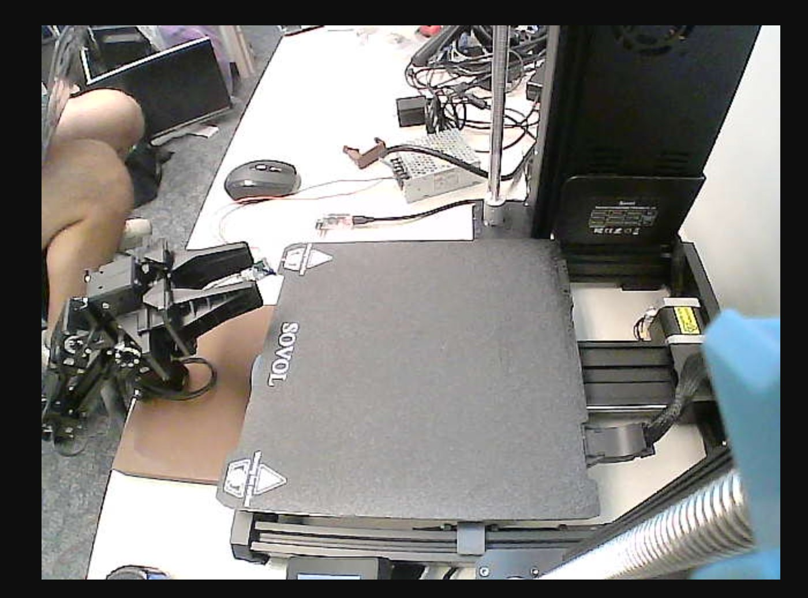

## ME597 New Cell-Based Manufacturing Code Files

This repository contains the MTConnect Agent and Adapter configuration for the Sovol SV06 Ace 3D printer, along with the computer vision tracking middleware used for part localization. This project is part of a research initiative for ME498/ME597 at Purdue University, focusing on the autonomous synchronization between a 3D printer and a robotic manipulator arm. The repository contains the middleware and integration scripts required to synchronize a **Sovol SV06 Ace** 3D printer with a **Unity** virtual environment.

Using MTConnect standards, we provide a data stream that allows the robotic manipulator arm to monitor printer status, nozzle coordinates, and safety sensors to facilitate automated part removal. In parallel, a vision tracking pipeline isolates printed parts on the bed and forwards their geometry to Unity to support pick-and-place planning.

---

## **System Architecture**

The integration architecture is divided into two parallel data pipelines.

### **Kinematic Pipeline (MTConnect)**

This pipeline streams live toolhead coordinates from the printer to the Unity digital twin, organized into four distinct layers to ensure low-latency communication and data integrity:

1. **Hardware Interface (Moonraker API):** The printer serves hardware state and toolhead coordinates as JSON objects via the Moonraker API on **Port 7125**.  
2. **Middleware (Python Adapter):** The `sovol_ace_adapter.py` script polls the Moonraker API, parses the toolhead position, and transmits the data to the Agent on **Port 7878**.  
3. **Standardization Layer (MTConnect Agent):** The `agent_run` binary processes the incoming data stream according to the definitions in `Device.xml` and hosts a RESTful XML interface on **Port 5001**.  
4. **Visualization Layer (Unity):** A C\# implementation polls the Agent's XML feed and applies smoothed transforms to the virtual model.

### **Vision Pipeline (Live Tracker)**

This pipeline runs independently of MTConnect. The `live_tracker.py` script processes the printer's webcam stream, isolates objects on the bed via background subtraction, and transmits a transparent sprite of the detected part to Unity over **UDP Port 5005**. Unity projects this sprite onto the virtual bed at the correct world-space location and scale.

---

## **Repository Structure**

* **`start_twin.sh`**: A shell script utilizing Zenity for the graphical configuration of the printer's IP address and automated process management.  
* **`sovol_ace_adapter.py`**: The primary Python bridge optimized for Moonraker/Klipper API through JSON files.
* **`agent_run` & `agent.cfg`**: The C++ MTConnect Agent executable and its associated configuration parameters.  
* **`Device.xml`**: The MTConnect Device Information Model defining the component hierarchy (X, Y, Z axes, Extruder, and Bed).  
* **`mtconnect_adapter.py` & `data_item.py`**: Supporting libraries for MTConnect-compliant data formatting.  
* **`Sovol Ace MTConnect Launcher.desktop`**: A Linux desktop launcher for Raspberry Pi. Essentially it just runs the start_twin.sh file that launches the adapter and agent at the same time.
* **`live_tracker.py`**: A standalone Python computer vision script that detects printed parts on the bed via webcam and broadcasts their geometry to Unity over UDP. See the dedicated section below.
* **`Low_angle_camera_mount.obj`**: A custom 3D-printable webcam mount that replaces the stock Sovol camera bracket with a low-angle perspective optimized for bed-level part detection. See the dedicated section below.

---

## **Installation and Deployment**

### **1\. Environment Preparation**

The system is designed to run on a Raspberry Pi within the same local area network (LAN) as the printer.

Bash  
\# Clone the repository and navigate to the directory  
cd \~/Desktop/mtconnect\_3dprinter

\# Ensure all binaries and scripts have execution permissions  
chmod \+x start\_twin.sh agent\_run

### **2\. Execution**

Launch the integration by executing the `start_twin.sh` script or using the desktop shortcut.

* Upon launch, a GUI prompt will request the **Printer IP Address**.  
* The script automatically manages process cleanup of previous sessions to prevent port conflicts.  
* Two terminal instances will initialize: the **Adapter** (data parsing) and the **Agent** (web server).

---

## **Unity Implementation**

The Unity client requires the `unity_mtconnect_reader.cs` script to be attached to a designated Controller GameObject.

### **Inspector Configuration**

* **Host IP:** The network IP address of the Raspberry Pi.  
* **Port:** **5001** (Requests must be directed to the Agent, not the Adapter).  
* **Component Mapping:** Assign the 3D transforms for the Toolhead, Gantry, and Bed.  
* **Data Item IDs:** Ensure mapping corresponds to the `Device.xml` IDs: `x_pos`, `y_pos`, and `z_pos`.

---

## **Vision Bridge — `live_tracker.py`**

This is the *other* live data path into the digital twin. It is what makes the system aware of finished or in-progress parts sitting on the bed, which is the prerequisite for the manipulator arm being able to pick them up.

### **Overview**

A Python script that pulls the printer's webcam stream and isolates objects on the bed by background subtraction.

* Connects to the printer's webcam via its LAN URL (`http://192.168.1.8/webcam/?action=stream` by default).
* Reads frames on a daemon thread so dropped frames or network hiccups don't stall the tracker.
* Compares each frame against a stored reference image (`blank_bed.png`) of the empty bed.
* Applies CLAHE contrast normalization in LAB color space, computes HSV saturation/value diffs, blends in Canny edge information, thresholds, and morphologically opens — the result is a clean binary mask of "things that weren't there before".
* Masks the result against a hand-calibrated pentagon outlining the bed in camera space so the printer frame, gantry, and surroundings are ignored.
* Picks the largest valid contour, applies area gating (rejects noise and lighting shifts), and runs an exponential moving average on the bounding box for temporal smoothing.
* Crops the frame to that bounding box, uses the binary mask as an alpha channel, and encodes a **transparent BGRA PNG** of just the object.
* Sends a UDP packet to Unity in the format `"centerX,centerY,width,height|<PNG bytes>"`.
* Includes a dynamic packet-size limiter that shrinks the sprite by 15% increments if the encoded packet exceeds macOS's ~9216-byte UDP datagram limit.
* Exposes live tuning sliders (threshold, saturation weight, Canny min, dilation, min/max area) in an OpenCV control window. Press **`B`** to capture a new blank-bed reference, **`Q`** to quit.

The script expects a `blank_bed.png` reference image at `~/Desktop/PrinterResearch/RealPhotos/blank_bed.png`. Capture this once with the bed empty before starting tracking.

### **Configuration**

Three constants near the top of `live_tracker.py` are environment-specific and may need adjustment:

* **`STREAM_URL`** — the printer webcam's MJPEG endpoint. Update this if the printer's IP differs from the default.
* **`UDP_IP`** — destination address for the sprite stream. Defaults to `127.0.0.1`; set this to the Unity workstation's IP if the tracker is running on a separate machine.
* **`UDP_PORT`** — destination UDP port. Must match the `port` field on the Unity-side `SpriteReceiver.cs` component (default `5005`).

The bed-mapping pentagon (`current_pts`) is calibrated for the current camera mount and resolution; if the camera is moved, this polygon should be re-traced from a fresh frame.

---

## **Hardware — `Low_angle_camera_mount.obj`**

A custom 3D-printable webcam mount designed to replace the stock Sovol SV06 Ace camera bracket. The stock mount positions the camera high on the gantry frame, which produces a steep top-down view of the bed and limits the visibility of low-profile printed parts. This custom mount drops the camera significantly closer to bed level and angles it forward, producing a much more useful perspective for the vision pipeline.

### **Why a Custom Mount**

The vision tracking in `live_tracker.py` relies on background subtraction against a known-empty reference frame. Two practical issues with the stock camera placement motivated this redesign:

* **Steep viewing angle compresses the bed in the frame**, leaving printed parts occupying a small fraction of the image and reducing the effective resolution available for contour detection.
* **The toolhead and gantry occlude the bed** during most prints, requiring the live tracker to either wait for the printer to park or work around occlusions — both of which complicate the detection logic.

The low-angle mount addresses both issues by repositioning the camera below the gantry plane and tilting it upward toward the front of the bed. This produces a wider, more orthographic view of the print surface and significantly reduces toolhead occlusion during normal operation.

### **Mount Geometry**

The mount is a single-piece print designed to clamp onto the printer's vertical Z-axis aluminum extrusion. The camera body sits in a recessed cradle angled forward roughly 30° from vertical, secured against the housing.

### **Installed View**

When installed on the printer, the mount integrates cleanly with the existing teal-colored Sovol housing aesthetic:

### **Resulting Camera Perspective**

The view from the installed camera shows the full bed clearly, with the bed plate occupying the majority of the frame and minimal interference from the toolhead during most print states:

This is the perspective that all of the calibration constants in `live_tracker.py` and the corresponding `SpriteReceiver.cs` (in the [Unity repo](#)) are tuned for. If you use a different camera mount, the bed pentagon (`current_pts`) and the bed-pixel mapping constants (`bedPixelWidth`, `bedPixelDepth`, `minX`, `minY`) will need to be re-calibrated.

### **Print Settings**

The `.obj` file is provided as raw geometry — slice it in your preferred slicer with the following recommendations:

* **Material:** PETG or PLA. PETG preferred for the heat tolerance near the printer enclosure.
* **Infill:** 30–40% gyroid or grid.
* **Supports:** Required on the camera cradle overhang.
* **Orientation:** Print with the extrusion-clamp face down for the best surface finish on the visible front face.

---
